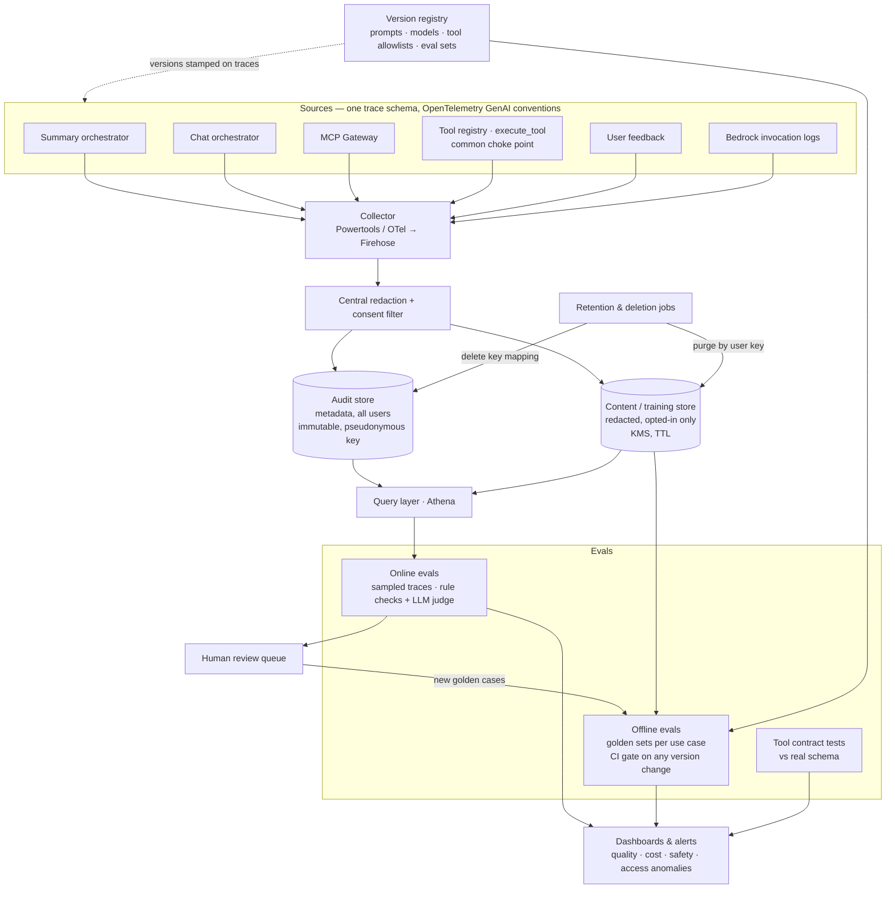

# AI Governance & Monitoring: Centralized Evals and Auditing

How to evaluate and audit all three AI integrations (financial summary, in-app open chat, user's own assistant) from one place. See [ai-integration-architecture.md](ai-integration-architecture.md) for the integrations themselves.

## Best practices

1. **One trace schema for all integrations.** Every AI event carries:
   - trace ID, integration (summary, chat or external), use case
   - pseudonymous user key
   - model, prompt version, tool allowlist version
   - tool calls, outcome, guardrail hits, tokens and cost

   Use OpenTelemetry GenAI conventions. External-assistant traces carry tool-level fields only.
2. **Instrument the choke points:**
   - `execute_tool` in the tool registry, the one place all three integrations pass through
   - the two orchestrators, for prompts and outputs
   - the MCP Gateway, for external identity and access
3. **Version registry.** Prompts, models, tool allowlists and eval sets are kept as config in code. Every trace is stamped with these versions, so results can be reproduced and compared.
4. **Two storage tiers.** Audit holds metadata for all users, is immutable and is kept long-term. Content/training holds redacted traces from opted-in users only, KMS-encrypted, with a TTL. Redaction and the consent check run once, centrally, before anything is stored.
5. **Offline evals as a deploy gate.** Each use case has a golden question set. It runs in CI on every prompt, model or tool change, and a failing run blocks the deploy.
6. **Online evals on sampled production traces.** Rule checks (numbers match the facts, evidence references exist, no banned terms, within scope) plus an LLM judge. Low scores go to a human review queue.
7. **Tool contract tests against the real schema.** For the external assistant, tool correctness is the only quality lever we have.
8. **Close the loop.** Production failures and negative feedback become new golden cases.
9. **Dashboards and alerts by integration:** fallback rate, validation failures, guardrail hits, cost per user and per tier, latency, tool error rate, and unusual external access.
10. **Deletion that works with immutable storage.** The audit store keeps only pseudonymous keys. On account deletion, delete the key mapping (crypto-shredding) so audit records can no longer be linked to the person, and purge the user's records from the content store.
11. **Least-privilege access to traces**, with an emergency ("break-glass") access path. Bedrock model invocation logging is a backstop for the summary and chat integrations.

## Governance and monitoring architecture

| Integration | What can be evaluated |
|---|---|
| ① Financial summary | Everything: schema, numbers, evidence, scope, cost |
| ② In-app open chat | Everything except strict schema checks; online judging carries more weight |
| ③ User's own assistant | Tool correctness, access patterns and abuse only; the final answer can't be seen |
