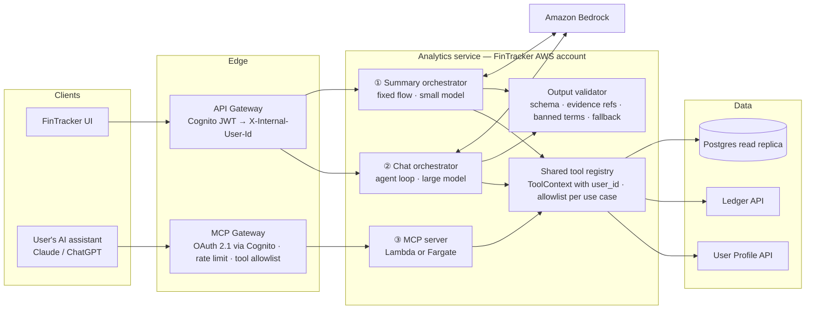
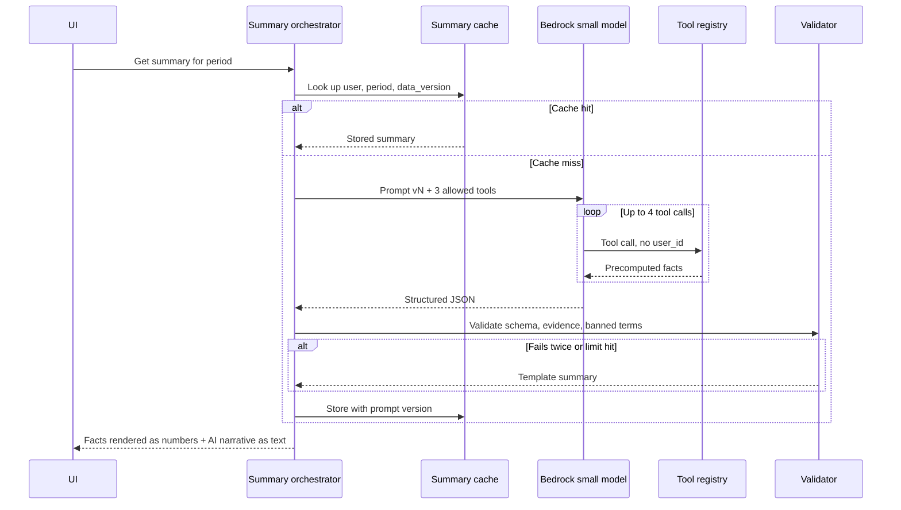
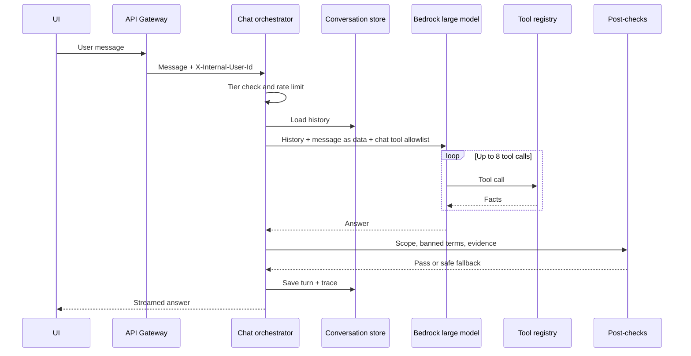
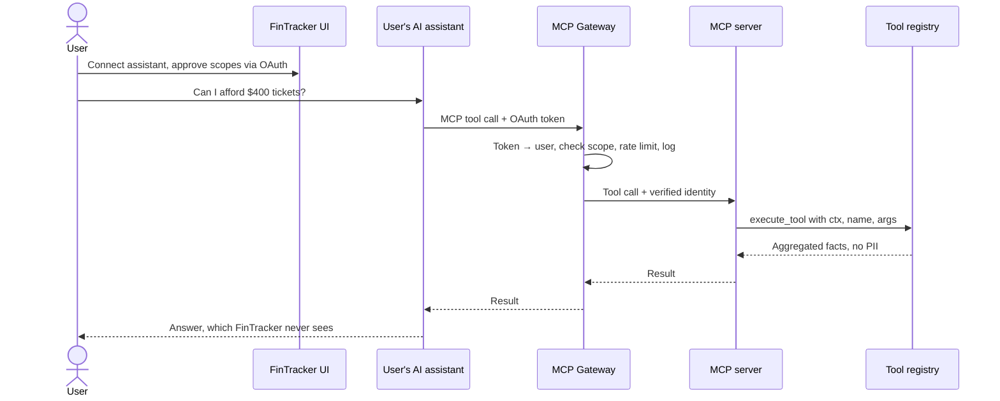

# AI Integration Architecture: Analytics

FinTracker integrates AI in three ways:
1. **Financial summary**: FinTracker generates it on the backend and validates it.
2. **In-app open chat**: FinTracker runs the AI agent.
3. **User's own AI assistant**: an external assistant reaches FinTracker through an MCP Gateway.

All three share one tool layer. The user's identity always comes from the authenticated session or token, never from the model.

## Overview: three entry points, one shared tool layer

| | ① Financial summary | ② In-app open chat | ③ User's own assistant |
|---|---|---|---|
| Who runs the AI loop | FinTracker | FinTracker | User's assistant |
| Where the model runs | Bedrock, in our account | Bedrock, in our account | Third-party provider |
| Who pays for the model | FinTracker (small model, cached, batch) | FinTracker (rate-limited by tier) | The user |
| What FinTracker sees | Everything | Everything | Tool calls only |
| Output control | Full: schema, validator, fallback | Strong: post-checks, safe fallback | None beyond the facts returned |
| Identity source | Session (API Gateway) | Session (API Gateway) | OAuth token (MCP Gateway) |

## ① Financial summary workflow

A nightly EventBridge job on the 1st of each month precomputes "Last month" summaries with Bedrock batch inference.

## ② In-app open chat workflow

## ③ User's own assistant workflow

