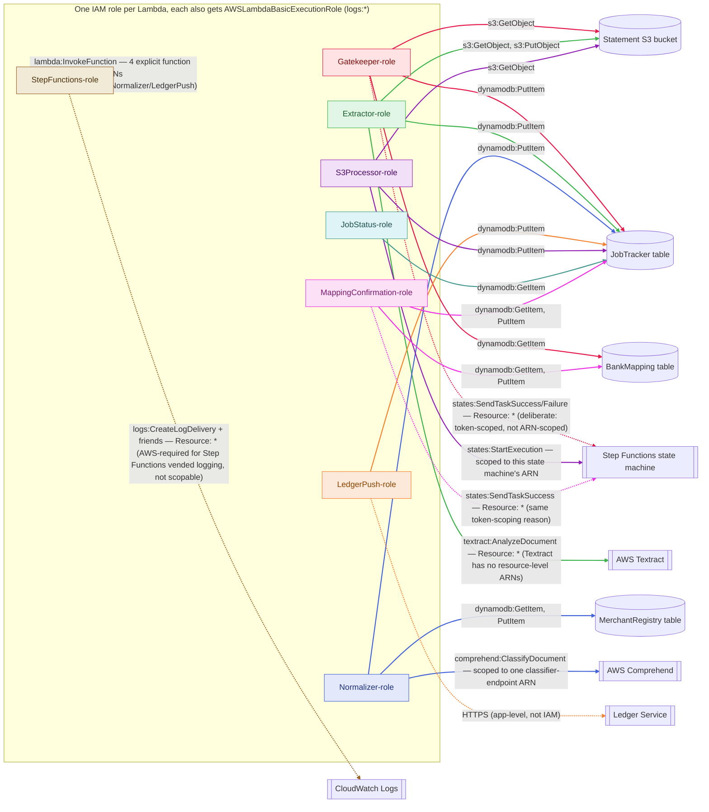

# Data Pipeline — IAM Roles & Permissions

Reflects `services/fintracker-data-pipeline/infrastructure/terraform/environments/dev/main.tf` +
`modules/lambda_function/main.tf` + `modules/step_functions_pipeline/main.tf` as deployed today.
Every Lambda gets its **own** IAM role (no sharing) — that part is already correct
least-privilege practice; the diagram below shows what each role can actually touch.

Each role has one color, applied to both its box (fill) and every edge leaving it — trace a
single role's reach by following one color instead of untangling black lines. Solid vs. dashed
still marks scoped vs. wildcarded, independent of color.

## Findings

| # | Severity | Where | Issue |
|---|---|---|---|
| 1 | Informational | `Gatekeeper-role`, `MappingConfirmation-role`: `states:SendTaskSuccess`/`SendTaskFailure` on `Resource: "*"` | Comment in `main.tf` explains this is deliberate — a `waitForTaskToken` resume is authorized by the token itself, not the state machine ARN, so AWS doesn't offer a tighter `Resource` to scope to. Worth a periodic recheck against current AWS docs, but not a misconfiguration as written. |
| 2 | Informational | `StepFunctions-role`: `logs:CreateLogDelivery`/`GetLogDelivery`/`UpdateLogDelivery`/`DeleteLogDelivery`/`ListLogDeliveries`/`PutResourcePolicy`/`DescribeResourcePolicies`/`DescribeLogGroups` on `Resource: "*"` | Required, AWS-documented pattern for Step Functions execution logging — these specific log-delivery actions don't support resource-level restriction. Not a repo-introduced gap. |
| 3 | Not a finding | `Extractor-role`: `textract:AnalyzeDocument` on `Resource: "*"` | Textract has no resource-level permissions at all; the action itself is already minimal (one action, not `textract:*`). |
| — | Good practice | Every DynamoDB/S3 statement across all 8 roles | Single specific actions (`GetItem`/`PutItem`, `GetObject`/`PutObject`) scoped to one table/bucket ARN each. No `dynamodb:*`, `s3:*`, or `iam:PassRole` grant found anywhere in this service's Terraform. |

**Bottom line: yes, Terraform already configures least privilege for these Lambdas**, to the
extent AWS's own API surface allows. The only `Resource: "*"` grants are cases where AWS itself
doesn't expose a narrower resource to scope to (task-token-authorized Step Functions calls,
Step-Functions-vended logging, and Textract) — not wildcards this repo chose out of convenience.
