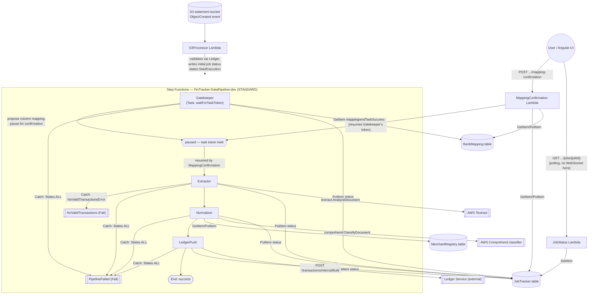

# Data Pipeline — Current Logic Flow

Reflects the actual deployed state today: `services/fintracker-data-pipeline/infrastructure/terraform/modules/step_functions_pipeline/statemachine.asl.json.tpl`
and the environment's `main.tf`. Not a target/spec state — this is what runs.

Two separate entry points exist: the S3-triggered ingestion pipeline (Step Functions), and two
plain HTTP API Lambdas the pipeline pauses for / is polled through. Neither `JobStatus` nor
`MappingConfirmation` is itself a Step Functions task — they talk to the state machine only via
DynamoDB (shared status) and, for `MappingConfirmation`, by resolving Gatekeeper's paused task
token.

## Notes on what's *not* here yet
- No `Retry` blocks anywhere in the ASL — every task's only error handling is a `Catch`
  straight to a terminal `Fail` state. A transient error (e.g. a Textract throttle) fails the
  whole job rather than retrying.
- `JobStatus` is polling-based; the pipeline spec's target design (per
  `data-pipeline-spec-01.md` / the root `CLAUDE.md`) is a WebSocket push via the User Profile
  Service on completion — not present in this flow because it isn't implemented in this pipeline
  yet.
- Both `MappingConfirmation` and `JobStatus` sit behind the same Cognito JWT HTTP API authorizer
  and overwrite `X-Internal-User-Id` from the JWT `sub` claim server-side — the client cannot
  supply or spoof it.
