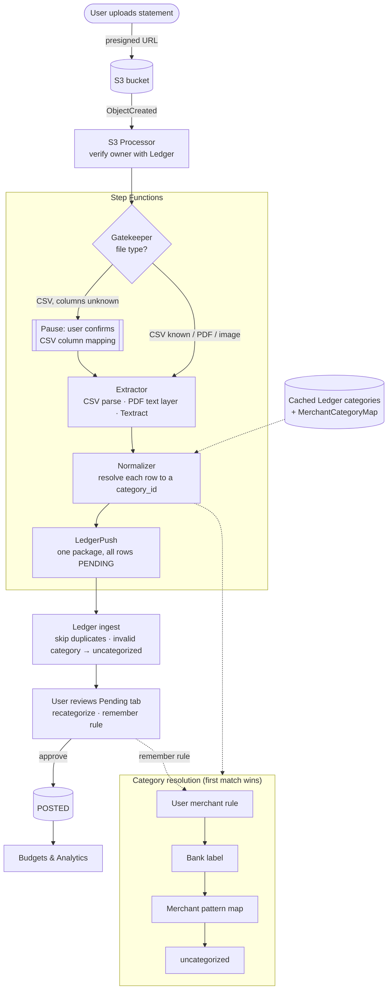

# Data Pipeline — Target Flow (after REQ-DP-09 + DP-Ledger Categories)

High-level logic only; for the deployed state today, see `data-pipeline-logic-flow.md`. This file shows the flow once the implementation plan in `implementation_plans/2026-09-28_dp_ledger_categories.md` is complete.

## Chart Desccription
1. Upload. The browser uploads the file straight to S3. The S3 event starts the pipeline after checking with the Ledger who owns the statement.

2. Gatekeeper. It detects the file type. A CSV from an unknown bank pauses until the user confirms which columns are date, merchant and amount (the renamed CsvColMappingConfirmation step).

3. Extractor. It reads rows: directly from a CSV (including the bank's category column), from a PDF's text, or through Textract for scans and images.

4. Normalizer. It gives every row a real Ledger category_id, taking the first match in this order: the user's merchant rule, the bank's label, the merchant pattern map, then uncategorized. It reads categories and patterns from an in-memory cache, not a database call per row.

5. LedgerPush. It sends one package per statement, with every row marked PENDING.

6. Ledger. It skips rows it already has, stores any row with an invalid category as uncategorized, and keeps everything PENDING.

7. Review. In the Pending tab the user fixes categories (optionally saving a "remember this merchant" rule, which feeds step 4 next time) and approves. Only approved rows count toward budgets and analytics.