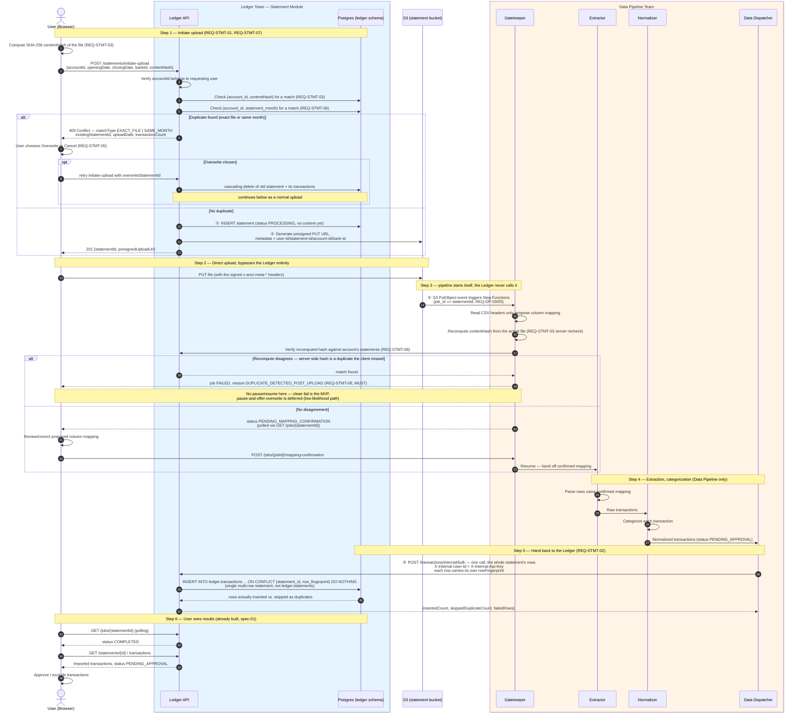

# Uploading a CSV Statement — End-to-End Flow

This diagram walks a CSV upload from click to imported transactions, across the two services that
jointly own this feature. **The Ledger service (Statement Module) and the Data Pipeline service are
built by two different teams — the boundary between them is the point of this document.** Anything
under "Ledger — Statement Module" below is that team's responsibility; anything under "Data
Pipeline" is the other team's. The only two places code on one side directly calls code on the
other are marked explicitly (①②③ below) — everywhere else, the two sides only ever communicate
through S3 (an upload lands, a trigger fires) or through the polling API (status is read, never
pushed).

Requirements referenced throughout are in `ledger-statement-spec-01.md` (what's built) and
`ledger-statement-spec-02.md` (what's planned) — this diagram reflects **spec-02's target state**,
including REQ-STMT-07/08 additions, not just what exists today.

## Ownership at a glance

| Boundary | Ledger — Statement Module | Data Pipeline |
|---|---|---|
| Owns | Statement record, presigned upload URL, duplicate detection & the user-facing decision, transaction persistence, statement listing/approval UI's data | Reading the file, column mapping, transaction extraction, categorization |
| Never does | Reads file content, talks to Textract/Comprehend | Creates/deletes statement records, decides account ownership, stores duplicate history |
| Cross-boundary calls | ① issues presigned S3 URL; accepts pushed transactions (③, REQ-STMT-02); answers the Gatekeeper's duplicate-recheck query (REQ-STMT-08) | ② triggered by the S3 event, never called directly by the Ledger; ③ pushes extracted transactions to the Ledger's internal endpoint |

## Sequence

## Notes on the branches not shown in full

- **REQ-STMT-04 (fuzzy content match, mid-processing):** not drawn above to keep the happy path
  legible — it's the same shape as the `PENDING_MAPPING_CONFIRMATION` pause, just triggered after
  `EX` finishes instead of before it starts, with `matchType: CONTENT_FINGERPRINT` and the same
  overwrite/cancel choice as REQ-STMT-05.
- **CSV only.** This diagram is specifically the CSV path per the filename — PDF/Image differ only
  in Steps 3–4 (no column-mapping pause; Gatekeeper/Extractor run the Tier 1/Tier 2 waterfall from
  `data-pipeline-spec-01.md` REQ-DP-01 instead). Steps 1, 2, 5, and 6 are identical for every format.

## Why the boundary is drawn where it is

A few things worth calling out explicitly, since they're easy to get wrong when two teams build
against this boundary independently:

- **The Ledger never sees the file.** Steps 1 and 2 are deliberately split — `initiate-upload`
  only ever receives metadata (dates, account, bank, a hash), never bytes. The Data Pipeline team
  can assume this and doesn't need to coordinate on file-size limits, multipart uploads, etc. with
  the Ledger team; that's entirely between the browser and S3.
- **The Data Pipeline never creates or deletes a statement record.** It only ever writes
  *transactions* against a `statement_id` that already exists (① happens before ② in every case).
  If the Ledger team changes how statements are created, the Data Pipeline side of the contract
  (③, and the mapping-confirmation/duplicate-recheck calls) doesn't need to change — it only ever
  needs a valid `statement_id` to hand back to.
- **Every cross-boundary call is authenticated as a trusted internal caller, not a user request** —
  `X-Internal-User-Id` + a shared internal API key, never a Cognito JWT. Both teams need to keep
  this consistent: the Data Pipeline team must keep sending the header (already true, REQ-DP-06),
  and the Ledger team must keep scoping every internal write by it (REQ-STMT-02's core requirement)
  — if either side drifts, the other side's tenant isolation guarantee breaks silently.
