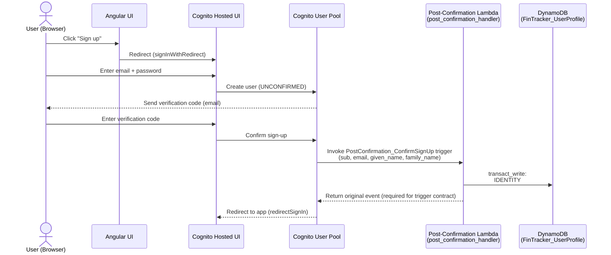
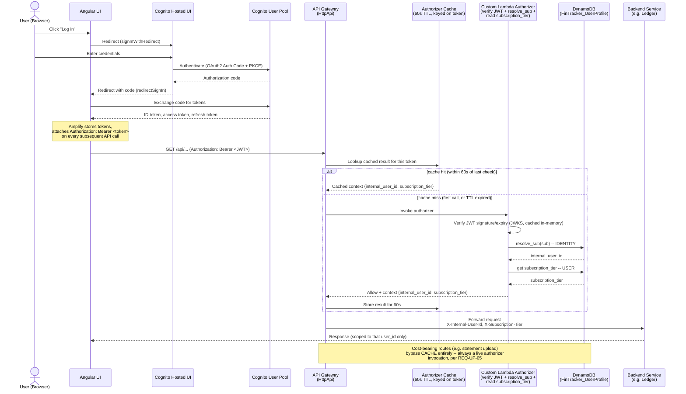

# Registration & Login Flow — Components and Roles

Reviews the user's understanding of the identity flow against the codebase
(`app/identity/`) and the architecture docs (`docs/fintracker-architectural-doc.md`,
`services/fintracker-user-profile/docs/fintracker-user-profile-architectural-doc.md`),
and diagrams both flows at a component level.

## Registration — confirmed correct

1. User opens the Cognito Hosted UI and registers with an email/password.
2. Cognito creates the user in `UNCONFIRMED` state, sends a verification code, and
   moves them to `CONFIRMED` once the code is entered.
3. Cognito fires the `PostConfirmation_ConfirmSignUp` trigger, invoking
   `post_confirmation_handler` (`app/identity/handlers.py`), which calls
   `IdentityService.register_user()` to write the `IDENTITY# → internal_user_id`
   mapping plus `PROFILE`/`SETTINGS` rows to DynamoDB.

**Roles:**
| Component | Role |
|---|---|
| Cognito Hosted UI | Collects credentials, enforces password policy, handles email verification — no custom SPA code |
| Cognito User Pool | Identity store; owns the `sub`, issues the Post-Confirmation trigger |
| Post-Confirmation Lambda | The *only* place that creates the `sub → internal_user_id` mapping; idempotent |
| DynamoDB (`FinTracker_UserProfile`) | Single-table store for the identity mapping, profile, and settings |

---

## Login — corrected

Original understanding, step 2, mixed up two unrelated mechanisms:

> "Cognito verifies the user with Cognito authorizer... (we need a Lambda authorizer
> instead, to check subscription/permissions and include it in the token)"

**Correction 1 — no authorizer runs during login at all.** An "authorizer" (Cognito
or Lambda) is an **API Gateway** concept: it validates a JWT that's attached to an
*incoming API request*. Login itself never goes through API Gateway — it's Cognito's
Hosted UI performing an OAuth2 Authorization Code + PKCE exchange directly against
the User Pool (verify credentials → issue authorization code → app exchanges the code
for ID/access/refresh tokens at Cognito's token endpoint). Authorizers only come into
play afterward, when the UI calls your backend APIs with the token it just got.

**Correction 2 — a Lambda authorizer cannot add claims to a token.** It runs once per
API call, decides allow/deny, and can attach extra data to *that request's* context —
but the JWT was already signed and issued by Cognito before the authorizer ever runs;
the authorizer has no way to reach back and modify it. Two different, real mechanisms
exist for what you're actually after, depending on where you want the data to live:

| Goal | Mechanism | Trade-off |
|---|---|---|
| Subscription/permissions baked into the JWT claims themselves | **Cognito Pre-Token Generation trigger** — a Lambda Cognito invokes at token-issuance time, before signing | Available anywhere for free (no lookup), but stale until next token refresh |
| Subscription/permissions checked fresh on every API call | **Lambda authorizer** at API Gateway, called per-request | Always current, costs a lookup per call — this is what the ledger architecture doc already names for the statement-upload endpoint ("SubScription Lambda to check user subscription and access limits") |

Neither exists in the codebase yet — this is a genuine open gap, not a one-line fix,
and the right choice depends on how fresh the subscription check needs to be per
endpoint.

**Resolved — see `docs/fintracker-user-profile-doc/user-profile-spec-01.md` for the full
requirements spec.** The ambiguity above is settled as: a **custom Lambda REQUEST
authorizer** (not the built-in Cognito/JWT type) does the sub-resolution, because a
built-in authorizer cannot call out to DynamoDB at all. That same authorizer also
resolves the user's subscription tier per request — Cognito is on the Basic/Lite plan,
which rules out embedding subscription in the access token via Pre-Token Generation
(that needs the Essentials/Plus plan), so a live DynamoDB read is the only option. To
keep this affordable, API Gateway caches the authorizer's result for **60 seconds**,
keyed on the access token — long enough to collapse a page-load's burst of parallel API
calls into a single authorizer invocation, short enough that a subscription change is
reflected within about a minute. Cost-bearing routes (statement upload) are explicitly
excluded from this cache and always check live (REQ-UP-05) — a downgraded user should
never be able to keep making paid Textract/Bedrock calls for up to a minute on a stale
cached "pro" context.

**Roles:**
| Component | Role |
|---|---|
| Cognito Hosted UI | Performs the actual credential check + OAuth2/PKCE token exchange — no authorizer involved |
| Cognito User Pool | Issues signed JWTs (ID/access/refresh); Basic/Lite plan means claim contents cannot be customized via Pre-Token Generation |
| API Gateway | Sits in front of every backend call; enforces the authorizer's decision and applies result caching |
| Authorizer Cache | API Gateway's built-in per-identity-source cache; 60s TTL bounds subscription staleness while absorbing bursty page-load traffic |
| Custom Lambda Authorizer | Verifies the JWT, resolves `sub → internal_user_id`, and reads `subscription_tier` — a built-in Cognito/JWT authorizer cannot do either lookup |
| DynamoDB (`FinTracker_UserProfile`) | Source of truth for both the identity mapping and the current subscription tier — never a Cognito custom attribute |
| Backend Service (Ledger, etc.) | Trusts `X-Internal-User-Id`/`X-Subscription-Tier` unconditionally because they can only be set upstream, never by the browser |

---

## Summary of corrections

1. Registration: no changes — matches the codebase.
2. Login: "Cognito authorizer" (login-time) → replace with "Cognito Hosted UI performs OAuth2 Authorization Code + PKCE directly against the User Pool"; no authorizer runs until the *next* API call.
3. "Lambda authorizer... to include subscription in the token" → split into two distinct, currently-unimplemented mechanisms: a **Pre-Token Generation trigger** (claims in the JWT) vs. a **Lambda authorizer** (per-request check, matches the ledger doc's subscription-gating design for uploads).
4. Resolved: `sub → internal_user_id` resolution and subscription lookup are both done by a single custom Lambda REQUEST authorizer (a built-in JWT authorizer can't do either), with API Gateway caching its result for 60s to bound cost — full requirements in `user-profile-spec-01.md`.
